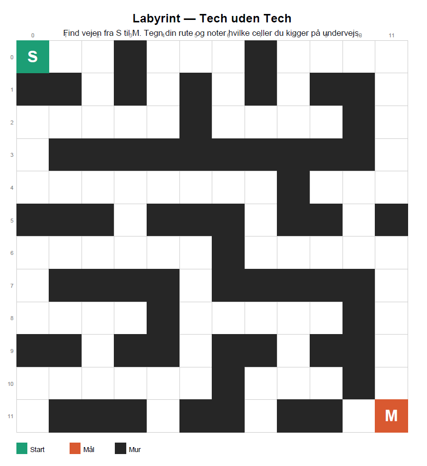

## Labyrint

Kig på labyrinten og find vejen fra S til M.

Noter undervejs:

Hvilke celler kigger du på?
Hvilke celler vælger du at gå til?
Hvilken strategi bruger du — går du bare frem, eller tænker du dig om?

Hvad ville Djikstra gøre? Hvert skridt fra ét felt til et andet koster 1 og murene er ikke en del af 
grafen idet vi ikke kan gå på dem. 

