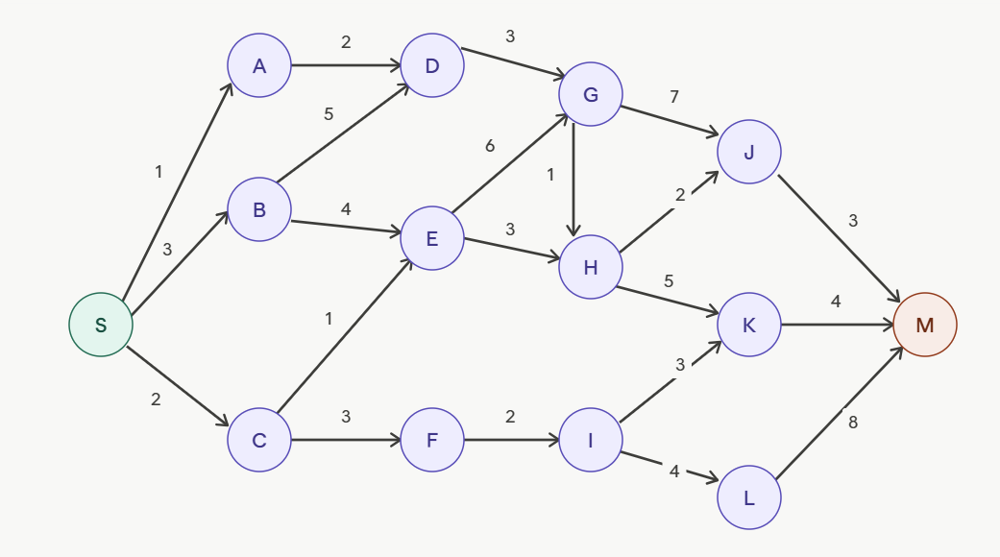

# Korteste vej

Kig på billedet 

Hvilken vej er kortest fra S til M? Kanterne er rettede og vægtede og du skal 
finde den vej, som koster mindst i forhold til vægtene. 

Noter hvilken strategi du brugte til at løse opgaven. 